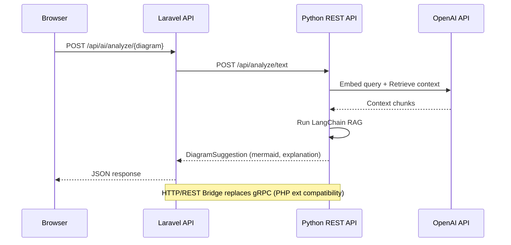

# Mecav — Multimodal Diagramming Platform

> A production-ready, AI-augmented diagramming platform with real-time
> Mermaid.js editing, versioned snapshots, and a decoupled AI inference
> layer backed by LangChain + pgvector RAG.

## Microservice Architecture

```mermaid
graph TD
    subgraph Browser
        U[User] -->|HTTP| LV[Laravel Blade\nMermaid Editor]
    end

    subgraph K8s Cluster — mecav namespace
        LV -->|REST + Sanctum| LA[Laravel API\nlaravel:8000]
        LA -->|HTTP REST| PS[Python AI Service\npython-service:8001]

        subgraph AI Pod
            PS --> REST[FastAPI REST Server]
            REST --> RAG[LangChain RAG Chain]
            RAG --> EMB[OpenAI Embeddings]
            RAG --> LLM[GPT-4o]
        end

        subgraph Agent Sidecars — optional
            WA[WhisperAgent\nVoice to Text]
            DA[DiagramDiffAgent\nAuto-snapshot]
            PS <-->|Process bidi-stream| WA
            PS <-->|Process bidi-stream| DA
        end

        LA --> DB[(PostgreSQL 16\npgvector)]
        PS --> DB
    end

    subgraph AWS
        DB --- RDS[RDS Aurora\nPostgreSQL]
        LA --- S3[S3 Export Storage]
    end
```

## API Flow Diagram



## Project Directory Structure

```
mecav/
├── docker-compose.yaml          # Local development orchestration
├── README.md                    # This file
├── protobuf/                    # Protocol Buffer definitions
│   └── multimodal.proto
├── services/
│   ├── laravel/                 # PHP API service
│   │   ├── app/
│   │   │   ├── Grpc/
│   │   │   │   ├── MultimodalClient.php      # HTTP REST client (bridge)
│   │   │   │   └── DiagramSuggestionResponse.php
│   │   │   ├── Http/Controllers/
│   │   │   │   ├── AiServiceController.php   # AI endpoints
│   │   │   │   └── DiagramController.php
│   │   │   └── Models/
│   │   │       ├── User.php
│   │   │       └── Diagram.php
│   │   ├── database/
│   │   │   └── factories/
│   │   │       ├── UserFactory.php
│   │   │       └── DiagramFactory.php
│   │   ├── routes/api.php
│   │   └── tests/Feature/AiServiceTest.php
│   └── python/                  # Python AI service
│       ├── app/
│       │   ├── rest_server.py   # FastAPI REST endpoints
│       │   ├── grpc_server.py   # gRPC server (legacy)
│       │   ├── rag_chain.py     # LangChain RAG implementation
│       │   └── settings.py
│       ├── tests/test_rest_server.py
│       └── Dockerfile
└── .env.example
```

## Architecture Overview

| Layer | Technology | Responsibility |
|---|---|---|
| Web UI | Laravel 11 Blade + Mermaid.js | Real-time diagram editing, snapshot management |
| API | Laravel 11 REST + Sanctum | CRUD, auth, AI proxy, export |
| AI Service | Python 3.11 + FastAPI | RAG inference, LangChain, pgvector retrieval |
| Vector DB | PostgreSQL 16 + pgvector | Embedding storage, ANN search |
| Transport | HTTP REST | Laravel ↔ Python communication |
| Proto Contract | Protocol Buffers v3 | Agent communication (sidecars) |
| Infra | Terraform + EKS + Helm | K8s deployment, managed RDS |

## HTTP/REST vs gRPC Extension

**Status**: The gRPC PHP extension is **not used** in production.

**Reason**: The gRPC PHP extension (`grpc.so`) has build compatibility issues with PHP 8.3/8.4 on Alpine Linux due to ABI conflicts during PECL compilation.

**Solution**: HTTP/REST bridge architecture

```
┌─────────────┐    HTTP REST    ┌──────────────────┐
│   Laravel   │ ──────────────▶ │  Python FastAPI  │
│  (PHP 8.3)  │                 │  (Port 8001)     │
└─────────────┘                 └──────────────────┘
                                               │
                    ┌───────────────────────────┘
                    ▼
            ┌──────────────────┐
            │   LangChain      │
            │   + pgvector     │
            └──────────────────┘
```

**Endpoint Mapping**:

| Laravel Client | Python Server | Purpose |
|---|---|---|
| `POST /api/ai/analyze/{diagram}` | `POST /api/analyze/text` | Get diagram suggestions |
| `GET /api/ai/health` | `GET /health` | Health check |
| `POST /api/diagrams/{id}/ai-suggest` | `POST /api/analyze/text` | AI suggestions |

**Next Steps**:
- [ ] Add streaming responses via Server-Sent Events (SSE)
- [ ] Implement file upload endpoint for large diagrams
- [ ] Consider gRPC-web for browser-based streaming

## Quick Start

### Docker Compose (Local Development)

```bash
# 1. Clone
git clone https://github.com/your-org/mecav && cd mecav

# 2. Start all services
docker compose up -d

# 3. Run migrations
docker exec mecav-laravel-api-1 php artisan migrate

# 4. Create admin user
docker exec mecav-laravel-api-1 php artisan tinker --execute="\App\Models\User::create(['name' => 'Admin User', 'email' => 'admin@mecav.local', 'password' => bcrypt('mecav2026!'), 'email_verified_at' => now(), 'role' => 'admin']);"

# 5. Open browser
open http://localhost:8000
```

### Default Credentials

| Email | Password |
|-------|----------|
| `admin@mecav.local` | `mecav2026!` |

### Service Ports

| Service | Port | URL |
|---------|------|-----|
| Laravel API | 8000 | http://localhost:8000 |
| Python REST | 8001 | http://localhost:8001 |
| Python gRPC | 50051 | grpc://localhost:50051 (legacy) |
| PostgreSQL | 5432 | localhost:5432 |

### Test Commands

```bash
# Laravel PHPUnit tests
docker exec mecav-laravel-api-1 php vendor/bin/phpunit

# Laravel AI Service tests
docker exec mecav-laravel-api-1 php vendor/bin/phpunit tests/Feature/AiServiceTest.php

# Python REST API health check
curl http://localhost:8001/health

# Python pytest tests
docker exec mecav-python-service-1 python -m pytest tests/ -v

# End-to-end API test
curl -X POST http://localhost:8000/api/ai/analyze/test-diagram \
  -H "Authorization: Bearer <token>" \
  -H "Content-Type: application/json" \
  -d '{"content": "flowchart TD; A --> B"}'
```

### Manual Setup (Non-Docker)

```bash
# 1. Configure environment variables
cp services/laravel/.env.example services/laravel/.env
cp services/python/.env.example  services/python/.env
# Edit both .env files — DATABASE_URL, OPENAI_API_KEY, GRPC_SERVICE_TOKEN

# 2. Compile proto stubs (Python)
cd services/python
python -m grpc_tools.protoc \
  -I ../../protobuf \
  --python_out=proto --grpc_python_out=proto \
  ../../protobuf/multimodal.proto

# 3. Laravel setup
cd ../laravel
composer install && php artisan key:generate && php artisan migrate

# 4. Python setup
cd ../python
pip install -r requirements.txt && alembic upgrade head

# 5. Start services
php artisan serve          # Laravel  → localhost:8000
python -m app.main         # gRPC     → localhost:50051
```

## Snapshot Policy

| Setting | Env Var | Default | Behaviour |
|---|---|---|---|
| Storage limit | `SNAPSHOT_STORAGE_BYTES` | 10 MB | Auto-prunes old snapshots when exceeded |
| Age limit | `SNAPSHOT_MAX_AGE_DAYS` | 90 days | Marks snapshots as expiring; 7-day grace period |
| Export lock | — | — | Exported snapshots are never auto-purged |
| Revert | — | — | Creates a new snapshot of current state before reverting |

## Roadmap

### v1.1 — Voice Input
- Wire `WhisperAgent` sidecar to `AnalyzeVoice()` gRPC endpoint
- Real-time audio streaming with Opus codec

### v1.2 — Multi-Agent Collaboration
- `DiagramDiffAgent`: semantic diff + auto-snapshot on change
- `ReviewAgent`: suggestions on diagram publish
- All agents attach as K8s sidecars via `Process()` bidi-stream

### v2.0 — Team Collaboration
- CRDT-based concurrent editing (Yjs)
- Tenant-isolated embedding namespaces
- Role-based diagram sharing (viewer / editor / admin)
- Export queue via Redis + S3 for async large-file delivery

## Scaling Notes

- **Stateless pods**: both Laravel and Python pods are fully stateless — use HPA on CPU/RPS
- **pgvector**: IVFFlat (`lists=100`) at launch; migrate to HNSW at >1 M embeddings
- **gRPC load balancing**: deploy Linkerd or Envoy for L7 gRPC-aware LB between Laravel and Python
- **Agent node group**: dedicated EKS node group with `g4dn.xlarge` Spot instances for GPU agents, tainted `workload=agents`
- **Storage quota enforcement**: run `php artisan diagrams:prune-snapshots` as a K8s CronJob (daily)
